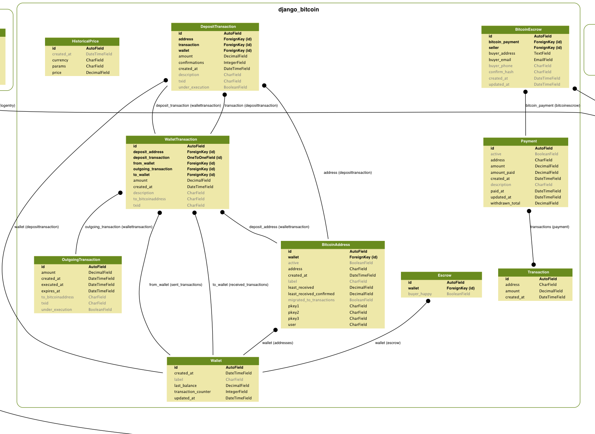

# bitcoin-zoo

## How to Install

```sh
sudo apt-get update
sudo apt-get install build-essential python-dev libmysqlclient-dev
sudo pip install -r requirements.txt
python manage.py  schemamigration django_bitcoin --initial
python manage.py syncdb
python manage.py migrate
python manage.py  runserver_plus 0.0.0.0:8000
python manage.py check_permissions
# this line is for userena bug
# Permission matching query does not exist
[open http://127.0.0.1:8000/docs/](http://127.0.0.1:8000/docs/)
```

## How to run celery tasks

go into the bitcoin-zoo directory
just enter the command :)

```
celery worker -A core -B --loglevel=INFO

```

## How to Debug Celery

```
modify /bitcoin-zoo/core/celeryconfig.py
CELERY_ALWAYS_EAGER = True
And then ....
```
## How to Run Testing Case

```
python manage.py test
or
Use PyDev Django Unit Testing

```

## bitcoin zoo er digram



## how to run flower

#### requirements

already add this package to requirements.txt so you can type
`pip install flower==0.7.3` or `pip install -r requirements.txt`

`CELERY_ALWAYS_EAGER = True`
remeber to change above settings to **False** because this will cause tasks to be executed
locally instead of being send to the **queue**

#### run it

1. start a worker
currently, the backend settings is redius( for detail, you can go to core/celeryconfig.py )

2. start flower monitor
flower will grab the celery settings of you project so no pain to get this works :) just feel free to use !

```sh
celery worker -A core -B --loglevel=INFO
celery flower -A core --address=127.0.0.1 --port=5555
```